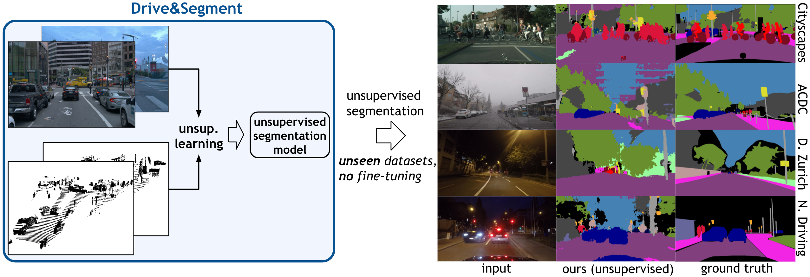

<h1 align="center">Welcome to the code for Drive&Segment 👋</h1>

<p align="center">
 <a href="TBD">
    
  </a>
  <a href="https://github.com/kefranabg/readme-md-generator/blob/master/LICENSE">
    
  </a>
  <a href="https://twitter.com/AVobecky">
    
  </a>
  <a href="https://huggingface.co/spaces/vobecant/DaS">
    
  </a>
</p>

# 🚙📷 Drive&Segment: Unsupervised Semantic Segmentation of Urban Scenes via Cross-modal Distillation

This project hosts the code for inference of the Drive&Segment for unsupervised image segmentation of urban scenes.

> [**Drive&Segment: Unsupervised Semantic Segmentation of Urban Scenes via Cross-modal Distillation**](TBD)            
> Antonin Vobecky, David Hurych, Oriane Siméoni, Spyros Gidaris, Andrei Bursuc, Patrick Pérez, and Josef Sivic
>
> *arXiv preprint ([arXiv XYZ.xyz](TBD))*

**Table of Contents**
- [Highlights](https://github.com/vobecant/DriveAndSegment#-highlights)
- [Examples](https://github.com/vobecant/DriveAndSegment#-examples)
- [Running the models](https://github.com/vobecant/DriveAndSegment#-running-the-models)
- [Citation](#-citation)



## 💫 Highlights

- 🚫🔬 **Unsupervised semantic segmentation:** Drive&Segments proposes learning semantic segmentation in urban scenes without any manual annotation, just from
the raw non-curated data collected by cars which, equipped with 📷 cameras and 💥 LiDAR sensors.
- 📷💥 **Multi-modal training:** During the train time our method takes 📷 images and 💥 LiDAR scans as an input, and
  learns a semantic segmentation model *without using manual annotations*.
- 📷 **Image-only inference:** During the inference time, Drive&Segments takes *only images* as an input.
- 🏆 **State-of-the-art performance:** Our best single model based on Segmenter architecture achieves **21.8%** in mIoU on
  Cityscapes (without any fine-tuning).
- 🚀 **Gradio Application**: We provide an interactive [Gradio application](https://huggingface.co/spaces/vobecant/DaS)
  so that everyone can try our model.

## 📺 Examples

### **Pseudo** segmentation.

Example of **pseudo** segmentation.


### Cityscapes segmentation.

Two examples of pseudo segmentation mapped to the 19 ground-truth classes of the Cityscapes dataset by using Hungarian
algorithm.


## ✨ Running the models

### 📝 Requirements

Please, refer to `requirements.txt`

### 🚀 Inference

We provide our Segmenter model trained on the nuScenes dataset.

Run

```
python3 inference.py --input-path [path to image/folder with images] --output-dir [where to save the outputs] --cuda
```

where:

- `--input-path` specifies either a path to a single image or a path to a folder with images,
- `output-dir` (optional) specifies the output directory, and
- `--cuda` is flag denoting whether to run the code on the GPU **(strongly recommended)**.

Example: `python3 inference.py --input-path sources/img1.jpeg --output-dir ./outputs --cuda`

### nuScenes model

We provide [weights](https://data.ciirc.cvut.cz/public/projects/2022DriveAndSegment/segmenter_nusc.pth) and config
files ([CPU](https://data.ciirc.cvut.cz/public/projects/2022DriveAndSegment/segmenter_nusc.pth_variant.yml)
/ [GPU](https://data.ciirc.cvut.cz/public/projects/2022DriveAndSegment/segmenter_nusc.pth_variant_gpu.yml)) for the
Segmenter model trained on the nuScenes dataset.

The weights and config files are downloaded automatically when running `inference.py`. Should you prefer to download
them by hand, please place them to the `./weights` folder.

### Waymo Open model

Due to the Waymo Open dataset licence terms, we cannot openly share the trained weights. If you are interested in using
the model trained on the Waymo Open dataset, please register at
the [Waymo Open](https://waymo.com/intl/en_us/dataset-download-terms/) and send the confirmation of your agreement to
the licence terms to the [authors](mailto:antonin.vobecky@cvut.cz).

## 📖 Citation
Please consider citing our paper in your publications if the project helps your research. BibTeX reference is as follows.
```
@article{XY,
  title     =  {},
  author    =  {},
  booktitle =  {arXiv preprint},
  year      =  {2022}
}
